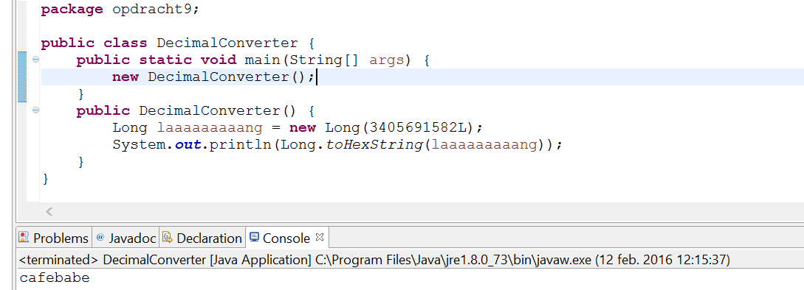
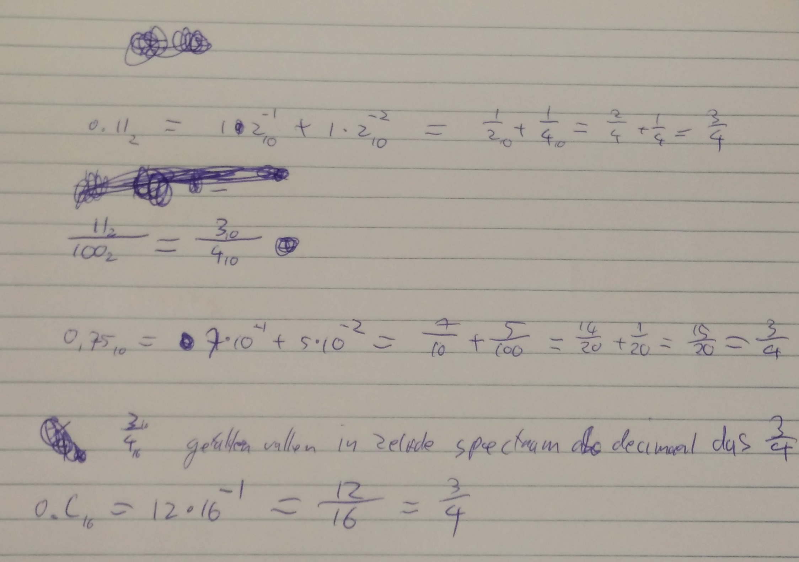

# Week 1

## Opdracht 1
Eigen antwoorden:
- Duidelijke gespecificeerde requirements 
- Duidelijke prijzen, betaalbaarheid
- Kwaliteit en onderhoudbaarheid van de code
- Schaalbaarheid

Even zoeken op google leverde het volgende artikel op:
http://www.academicjournals.org/article/article1380714134_Nasir%20and%20Sahibuddin.pdf

Dit is een literatuuronderzoek naar software ontwikkelprojecten in meerdere landen over de periode van 1990 tot 2010. Hier hebben ze gezocht naar kritische factoren binnen ontwikkelprojecten. De top 6 scorende lijst die overlapt met beide onderzoeken is:
- Clear objectives and goals
- Realistic schedule
- Effective project management skills/methodologies (project manager)
- Support from top management 
- User/client involvement
- Effective communication and feedback

Niet noodzakelijk maar wel interessant om te weten.


## Opdracht 2

|Term|	Software ontwikkelmethodiek|	Projectmanagement methodiek|	Opmerkingen|
|----|----|----|----|
|CMM|	❌ Niet|	✅ Wel||
|Extreme Programming|	✅ Wel|	❌ Niet||
|ISO|	❌ Niet|	✅ Wel||
|Prince2|	❌ Niet|	✅ Wel||
|RAD|	✅ Wel|	❌ Niet|Rapid application development|
|RUP|	✅ Wel|	❌ Niet|Rational Unified Process|
|SDM|	❌ Niet|	❌ Niet|System Development Methodology: een faseringsmethodiek|
|Spiral model|	✅ Wel|	❌ Niet||
|TQM|	❌ Niet|	❌ Niet|Managementmethodiek|
|Waterfall|	✅ Wel|	❌ Niet||


## Opdracht 3

HOM-projecten hebben de volgende fasen:

 - Initiatie, waarin projectmanagement, betrokken partijen etc. vastgelegd
   worden.
   Dit is aanwezig in de vorm van een Projectinitiatiedocument.
 - Requirements Analysis, waarin de projectspecificaties vastgelegd worden.
   Alle onderdelen zijn uitgewerkt in de documenten "Requirements Analyse" en
   "Beperkingen".
 - Design, waarin de software tot in detail ontworpen wordt.
   Verspreid over de mappen "Functioneel Ontwerp" en "Design" is ook hierover
   alles te vinden.
 - Development, waarin het ontwerp uitgetypt wordt.
   De complete broncode lijkt in een document geplakt te zijn, met wat extra
   informatie eromheen. Hoewel onhandig, is wel alles opgeleverd.
 - Testing, waarin een testaanpak ontwikkeld en uitgevoerd wordt.
   Ook hierover is van alles te vinden in de map "Testdocumentatie".

## Opdracht 4
Gezien het feit dat een fase pas begint na het opleveren van het eindrapport van de vorige fase. Daarnaast is er een duidelijk risicologboek. Dit duidt op Prince 2 als methode.

## Opdracht 5


## Opdracht 6

De methode beschreven in Brugali is meer iteratief. Er wordt in stappen gewerkt
waarbij telkens de Requirements herzien kunnen worden, en delen van het systeem
tijdens de loop van het project verder ontworpen worden. Dit houdt dus veel
meer rekening met veranderende requirements.

## Opdracht 7


## Opdracht 8

Zie HistoryView.java in de opdrachten map


## Opdracht 9

Zie uitwerking op papier en



## Opdracht 10

Zie Opdract10.java in de opdrachten map


## Opdracht 11

Projectplan met een definitie, overzicht en risicoanalyse en daarnaast een kostenoverzicht.


## Opdracht 12

Bij fixed price staat voor de klant absoluut vast wat het gaat kosten. Mocht het project langer duren is er minder geld voor de ontwikkellaars. Omgekeerd is er ook meer geld voor de ontwikkellaars als het korter duurt.

Bij nacalculatie krijgen de ontwikkellaars een vaste hoeveelheid geld. Nadeel voor de klant hierbij is wel dat niet vast staat hoe veel het voor de klant gaat kosten.


## Opdracht 13

Requirements nummeren is handig zodat tijdens het uitleggen of opsommen van requirements in andere documenten makkelijk gesorteerd en verwezen kan worden naar de originele requirementslijst.


## Opdracht 14



## Opdracht 15

**6.2:**

> n = ⌋log<sub>B</sub>(number)⌊

Hier is `B` de base van het gewenste talstelsel. `n` is de hoogste macht van `B`
die nog in `number` past, dwz:

```
B = 10
number = 112 = 1×10² + 1×10¹ + 2×10⁰
n = 2 → 10²

B = 7
number = 34 = 3×7¹ + 4×7⁰
n = 1 → 10¹ = 7
```

Deze formule werkt omdat <i>log<sub>B</sub>(number)</i> het tegenovergestelde is
van _number^B_. De `floor`-operatie die eromheen hangt zorgt ervoor dat er
altijd een geheel getal uitrolt, zodat we niet precies op 34 uitkomen als we
weer _B^n_ doen, maar op de "waarde" van de `n`-de positie in het talstelsel.
(De "waarde" van positie 3 in het getal 65,436 is dus 1000, want 5×1000 = 5000.)

**6.4:**

> _value(n) = number_  
> <i>c(i) = ⌋value(i) / B^i⌊</i>  
> _value(i) = value(i + 1) - c(i + 1) × B^(i + 1)_

Deze functies vormen samen een converter van een getal _number_ naar base _B_.
Met de functie _c(i)_ wordt het cijfer in positie _i_ berekend.

We beginnen in positie _n_ uit formule 6.2, oftewel de meest "linkse" positie in
het getal. Het cijfer in positie _n_ is `number / B^n`, bijvoorbeeld:

```
B = 10
number = 345
n = 2
c(n) = number / B^n
c(2) = floor(345 / 10²) = floor(3.45) = 3
```

Voor elke volgende positie wordt de functie _value(i)_ gebruikt:

> _value(i) = value(i + 1) - c(i + 1) × B^(i + 1)_

Hierin worden de vorige waarde van _i_ gestopt. Het gedeelte _- c(i + 1) × B^(i + 1)_
haalt alles wat we al geconvert hebben van het getal af:

```
B = 10
number = 345
value(1) = value(2) - c(2) × B² = number - 3 × 10² = 345 - 300 = 45
```

We hebben hier dus eigenlijk het eerste cijfer eraf getrimd, in base _B_.

Hieruit rolt een nieuwe _c(1)_, die dan gebruikt wordt voor _value(0)_, etc.
Uiteindelijk krijgen we voor `number = 345` en `B = 10` de resultaten:

 - _c(2) = 3_
 - _c(1) = 4_
 - _c(0) = 5_

Wat, lo and behold, het getal 345 in base 10 oplevert.

## Opdracht 16

Het onderhoud wordt gemakkelijker. Omdat er twee losse onderdelen zijn, hoef je
maar één onderdeel tegelijk in je hoofd te houden om een aanpassing te kunnen
doen. Ook het vinden van problemen wordt vergemakkelijkt: maakt de calculator
een rekenfout, dan weet je alvast dat het probleem waarschijnlijk niet in de UI
zit; heeft een cijfer de verkeerde kleur, dan hoef je in ieder geval niet in de
logica van de calculator zelf te kijken.

Losse onderdelen kunnen later ook onafhankelijk vervangen worden zolang de
interfaces gelijk blijven. In plaats van een CLI zou er bijvoorbeeld een
webinterface aan de calculator toegevoegd kunnen worden zonder aan de
applicatielogica te zitten.


## Opdracht 17

Bij drie formats moet elk format naar twee andere formats vertaald kunnen
worden, waarvoor een totaal van _3 × 2 = 6_ functies nodig zijn.

Bij vijf formats moet elk format naar vier andere vertaald worden, waarvoor
_5 × 4 = 20_ functies nodig zijn.


## Opdracht 18

Voor elk format is één parser nodig die een inputstring omzet naar een Rational.
Ook is er voor elk format één stringifier nodig die een Rational omzet naar één
van de formats.

Bij 3 formats zijn er dus _3 × 2 = 6_ functies nodig, 3× `parse` en 3×
`toString`. Bij 5 formats zijn er _5 × 2 = 10_ functies nodig.


## Opdracht 19


## Opdracht 20


## Opdracht 21


## Opdracht 22


## Opdracht 23


## Opdracht 24


## Opdracht 25


## Opdracht 26


## Opdracht 27


## Opdracht 28


## Opdracht 29


## Opdracht 30
