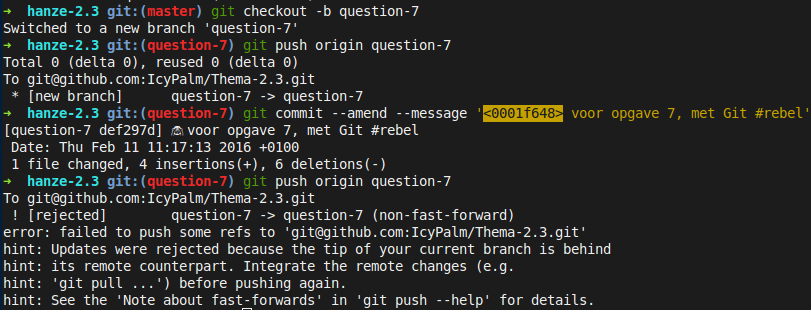
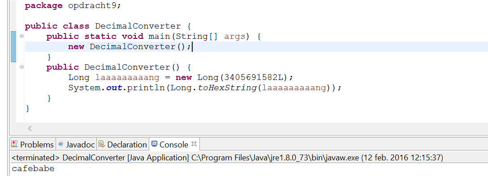

# Week 1

## Opdracht 1

- Duidelijk gespecificeerde requirements
- Cool

## Opdracht 2

|Term|	Software ontwikkelmethodiek|	Projectmanagement methodiek|	Opmerkingen|
|----|----|----|----|
|CMM|	❌ Niet|	✅ Wel||
|Extreme Programming|	✅ Wel|	❌ Niet||
|ISO|	❌ Niet|	✅ Wel||
|Prince2|	❌ Niet|	✅ Wel||
|RAD|	✅ Wel|	❌ Niet|Rapid application development|
|RUP|	✅ Wel|	❌ Niet|Rational Unified Process|
|SDM|	❌ Niet|	❌ Niet|System Development Methodology: een faseringsmethodiek|
|Spiral model|	✅ Wel|	❌ Niet||
|TQM|	❌ Niet|	❌ Niet|Managementmethodiek|
|Waterfall|	✅ Wel|	❌ Niet||

## Opdracht 3

HOM-projecten hebben de volgende fasen:

 - Initiatie, waarin projectmanagement, betrokken partijen etc. vastgelegd
   worden.
   Dit is aanwezig in de vorm van een Projectinitiatiedocument.
 - Requirements Analysis, waarin de projectspecificaties vastgelegd worden.
   Alle onderdelen zijn uitgewerkt in de documenten "Requirements Analyse" en
   "Beperkingen".
 - Design, waarin de software tot in detail ontworpen wordt.
   Verspreid over de mappen "Functioneel Ontwerp" en "Design" is ook hierover
   alles te vinden.
 - Development, waarin het ontwerp uitgetypt wordt.
   De complete broncode lijkt in een document geplakt te zijn, met wat extra
   informatie eromheen. Hoewel onhandig, is wel alles opgeleverd.
 - Testing, waarin een testaanpak ontwikkeld en uitgevoerd wordt.
   Ook hierover is van alles te vinden in de map "Testdocumentatie".

## Opdracht 4

## Opdracht 5

## Opdracht 6

## Opdracht 7

## Opdracht 8

Zie HistoryView.java in de opdrachten map

## Opdracht 9

Zie uitwerking op papier en

## Opdracht 10

Zie Opdract10.java in de opdrachten map

## Opdracht 11

Projectplan met een definitie, overzicht en risicoanalyse en daarnaast een kostenoverzicht.

## Opdracht 12

Bij fixed price staat voor de klant absoluut vast wat het gaat kosten. Mocht het project langer duren is er minder geld voor de ontwikkellaars. Omgekeerd is er ook meer geld voor de ontwikkellaars als het korter duurt.

Bij nacalculatie krijgen de ontwikkellaars een vaste hoeveelheid geld. Nadeel voor de klant hierbij is wel dat niet vast staat hoe veel het voor de klant gaat kosten.

## Opdracht 13

Requirements nummeren is handig zodat tijdens het uitleggen of opsommen van requirements in andere documenten makkelijk gesorteerd en verwezen kan worden naar de originele requirementslijst.

## Opdracht 14

## Opdracht 15

## Opdracht 16

## Opdracht 17

## Opdracht 18

## Opdracht 19

## Opdracht 20

## Opdracht 21

## Opdracht 22

## Opdracht 23

## Opdracht 24

## Opdracht 25

## Opdracht 26

## Opdracht 27

## Opdracht 28

## Opdracht 29

## Opdracht 30
