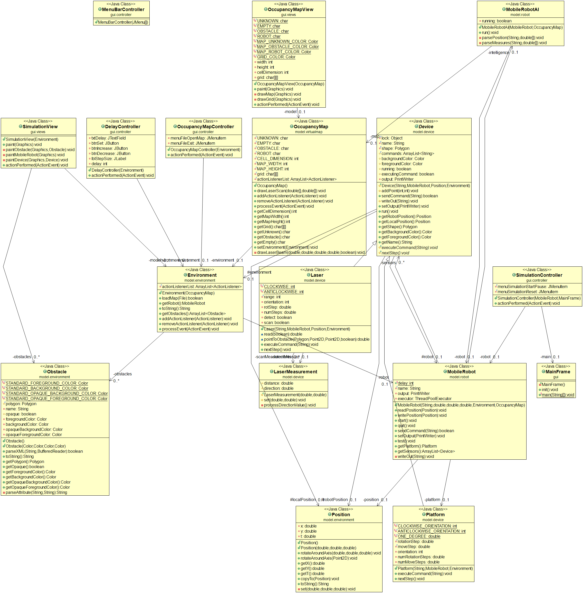
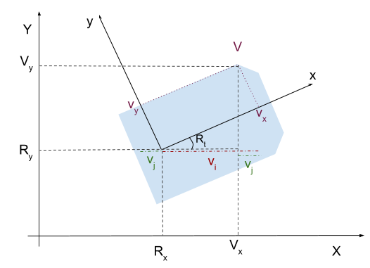
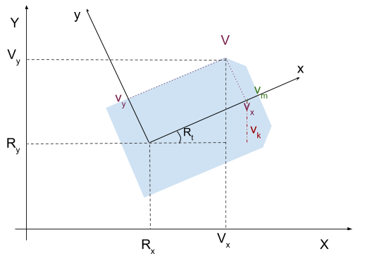

# Week 4

## Opdracht 1

### 29.4

Zie [SumThreads.java](../../Code/lt4-opdracht-1/src/lt4/SumThreads.java).

Gebruikelijke output:

```
$ make sum-threads
Unsynchronized: 989
Synchronized: 1000
```

### 29.8

Zie [ThreadCooperation.java](../../Code/lt4-opdracht-1/src/lt4/ThreadCooperation.java).

### Synchronizing threads using locks

Zie [DoublePrint.java](../../Code/lt4-opdracht-1/src/lt4/DoublePrint.java).

### Synchronizing threads using conditions

Zie [DoublePrintReverse.java](../../Code/lt4-opdracht-1/src/lt4/DoublePrintReverse.java).

## Opdracht 2



## Opdracht 3

**Geef aan welk lijnstukje de lengte _v<sub>x</sub> × cos(R<sub>t</sub>)_ heeft.**

> cos(R<sub>t</sub>) = (v<sub>i</sub> ÷ v<sub>x</sub>)  
> v<sub>x</sub> × cos(R<sub>t</sub>) = v<sub>i</sub> ÷ v<sub>x</sub> × v<sub>x</sub>

> v<sub>i</sub> = v<sub>x</sub> × cos(R<sub>t</sub>)_

(in rood)

**Geef aan welk lijnstukje de lengte _v<sub>y</sub> × sin(R<sub>t</sub>)_ heeft.**

> sin(R<sub>t</sub>) = (v<sub>j</sub> ÷ v<sub>y</sub>)  
> v<sub>y</sub> × sin(R<sub>t</sub>) = v<sub>j</sub> ÷ v<sub>y</sub> × v<sub>y</sub>

> v<sub>j</sub> = v<sub>y</sub> × sin(R<sub>t</sub>)

(in groen)

**Verklaar nu de eerste vergelijking (V<sub>x</sub> = …)**



> V<sub>x</sub> = v<sub>x</sub> × cos(R<sub>t</sub>) - v<sub>y</sub> × sin(R<sub>t</sub>) + R<sub>x</sub>

> V<sub>x</sub> = R<sub>x</sub> + v<sub>i</sub> - v<sub>j</sub>

Om te vertalen van een lokale coordinaat _v<sub>x</sub>_ naar een globale
coordinaat _V<sub>x</sub>_, nemen we eerst de oorsprongcoordinaat van het vlak
_v_ (= _R<sub>x</sub>_). In de afbeelding is te zien dat het verschil tussen
de oorsprongscoordinaat _R<sub>x</sub>_ en de lokale coordinaat _v<sub>x</sub>_
gelijk is aan _v<sub>i</sub> - v<sub>j</sub>_.

**Neem een nieuw plaatje en doe hetzelfde voor V<sub>y</sub>.**

> V<sub>y</sub> = v<sub>x</sub> × sin(R<sub>t</sub>) + v<sub>y</sub> × cos(R<sub>t</sub>) + R<sub>y</sub>



> sin(R<sub>t</sub>) = v<sub>k</sub> ÷ v<sub>x</sub>  
> v<sub>x</sub> × sin(R<sub>t</sub>) = v<sub>k</sub>

(in rood)

> cos(R<sub>t</sub>) = v<sub>m</sub> ÷ v<sub>y</sub>  
> v<sub>y</sub> × cos(R<sub>t</sub>) = v<sub>m</sub>

(in groen)

> V<sub>y</sub> = R<sub>y</sub> + v<sub>k</sub> - v<sub>m</sub>

Om te vertalen van een lokale coordinaat _v<sub>y</sub>_ naar een globale
coordinaat _V<sub>y</sub>_, nemen we eerst de oorsprongcoordinaat van het vlak
_v_ (= _R<sub>y</sub>_). In de afbeelding is te zien dat het verschil tussen
de oorsprongscoordinaat _R<sub>y</sub>_ en de lokale coordinaat _v<sub>y</sub>_
gelijk is aan _v<sub>k</sub> + v<sub>m</sub>_.

## Opdracht 4

**Wat zie je als er geen obstakels worden gescand?**

Niks, want er zijn dan verder geen tokens om te parsen

## Opdracht 5

Het idee is om de muur te gaan volgen met de rechterhand, ofwel: `Right hand rule`. Rij naar dichtsbijzijnde muur, stuur links zodat je langs de muur komt te staan. Rij rechtdoor todat er een mogelijkheid is om rechtsaf te gaan. Komt deze niet, sla linksaf zodra je (bijna) tegen de muur aanrijdt. 

Tussendoor moet uiteraard wel gescand worden om te bepalen of de muur verder loopt.

## Opdracht 6

(…)

## Opdracht 7

(…)

## Opdracht 8

(…)
